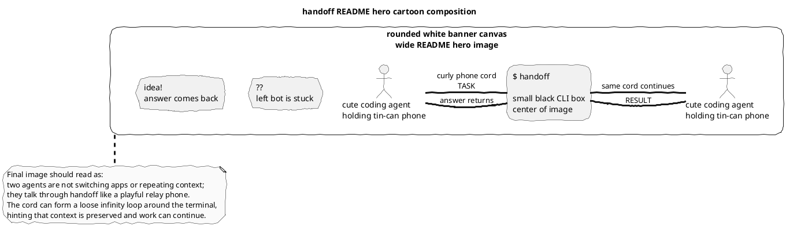

# handoff Hero Image Plan

目标：为 `README.zh-CN.md` 顶部 hero 前方生成一张“一眼能懂”的卡通 banner。不要画架构图，不要画流程图，不要堆节点和说明文字。画面应该像黑白手绘漫画：两个 coding agent 通过中间的 `handoff` 小终端互相派活，任务和答案沿着一根电话线/传声筒线来回传递。

参考风格：用户给的黑白卡通图。粗线条、圆角白底、可爱机器人、夸张表情、极少文字、README 顶部可用的横向插图。

最终图片内容：

- 横向白底圆角 banner，适合放在 README 顶部标题 `handoff` 前面。
- 左边一只卡通 coding agent，拿着传声筒/罐头电话，头顶气泡是 `??`，表示“当前 agent 卡住了或想派活”。
- 中间是一个小黑色终端盒子，只写 `$ handoff`，作为画面视觉中心。
- 右边一只卡通 coding agent，拿着另一端传声筒，头顶气泡是灯泡或 `!`，表示“接到任务后给出答案/第二意见”。
- 一根粗黑电话线从左 agent 连到中间终端，再连到右 agent；线在终端前打一个松散的环或无限符号，暗示“不丢上下文、可续接”。
- 线附近可以有两张很小的纸片：一张写 `task` 往右飞，一张写 `result` 往左回，但不要出现大段解释。
- 整体像可爱的开源项目 README doodle，不像产品营销图，也不像系统架构图。

生成图片时的关键约束：

- 黑白为主，粗线条，少量灰色阴影即可。
- 不要画多节点架构图、数据库、仪表盘、流程箭头。
- 不要出现大段中文或英文说明。
- 主要文字只保留 `$ handoff`、`task`、`result`、`??`、`!` 这类短文本。
- 画面第一眼表达：“把活儿交给另一个 agent，结果回到当前会话”。
